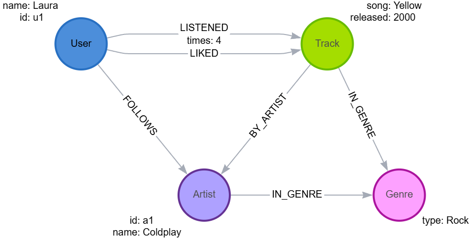

# 🎧 Music Recommendation System using Neo4j & Cypher

## 📌 Overview

This project implements a graph-based music recommendation system using Neo4j. The goal is to model users, tracks, artists, and genres in a graph structure to identify listening patterns and generate personalized music recommendations.

Graph databases are ideal for this type of problem because they make it easy to navigate connections such as "users who liked similar songs", "songs from artists a user follows", and "tracks related by genre".

## 🚀 Project Objectives

The system is designed to:

- Represent users, tracks, artists, and genres as nodes in a graph.
- Represent interactions such as listening, liking, or following using relationships with properties.
- Use Cypher queries to generate personalized recommendations based on graph connections.

## 🧩 Graph Data Model

### Node Labels

- User
- Track
- Artist
- Genre

### Relationships

| Relationship                                       | Description                       |
| -------------------------------------------------- | --------------------------------- |
| `(:User)-[:LISTENED {times}]->(:Track)`            | User listened to a track          |
| `(:User)-[:LIKED]->(:Track)`                       | User liked a track                |
| `(:User)-[:FOLLOWS]->(:Artist)`                    | User follows an artist            |
| `(:Track)-[:BY_ARTIST]->(:Artist)`                 | Track created by an artist        |
| `(:Track)-[:IN_GENRE]->(:Genre)`                   | Track belongs to a genre          |
| `(:Artist)-[:IN_GENRE]->(:Genre)`                  | Artist is associated with a genre |

This structure enables multiple recommendation strategies such as collaborative filtering, artist-based recommendations, and genre-based suggestions.

## 🧱 Data Model Diagram



## 🔍 Useful Cypher Queries

1. Recommend tracks based on genres the user listens to

```cypher
MATCH (u:User {id:"u1"})-[:LISTENED]->(:Track)-[:IN_GENRE]->(g:Genre)
MATCH (g)<-[:IN_GENRE]-(t:Track)
RETURN DISTINCT t.title AS track, g.name AS genre;
```

### 🎧 1. Recomendações de Tracks (músicas)

✅ 1.1 Tracks do mesmo artista que o usuário já ouviu

```cypher
MATCH (u:User {name: "Laura"})-[:LISTENED]->(:Track)-[:BY_ARTIST]->(a:Artist)
MATCH (a)-[:BY_ARTIST]-(t2:Track)
WHERE NOT (u)-[:LISTENED]->(t2)
RETURN DISTINCT t2 AS recommendedTrack, a.name AS artist
LIMIT 10;
```

✅ 1.2 Tracks do mesmo gênero que o usuário já ouviu

```cypher
MATCH (u:User {name: "Andres"})-[:LISTENED]->(t:Track)-[:IN_GENRE]->(g:Genre)
MATCH (g)<-[:IN_GENRE]-(t2:Track)
WHERE NOT (u)-[:LISTENED]->(t2)
RETURN DISTINCT t2 AS recommendedTrack, g.name AS genre
LIMIT 10;
```

### 🎤 2. Recomendações de Artistas

✅ 2.1 Artistas do mesmo gênero dos artistas já seguidos

```cypher
MATCH (u:User {name: "Diego"})-[:FOLLOWS]->(a:Artist)-[:IN_GENRE]->(g:Genre)
MATCH (g)<-[:IN_GENRE]-(a2:Artist)
WHERE NOT (u)-[:FOLLOWS]->(a2)
RETURN DISTINCT a2 AS recommendedArtist, g.name AS genre
LIMIT 10;
```

✅ 2.2 Artistas que produziram tracks que o usuário escuta muito

```cypher
MATCH (u:User {name: "Andres"})-[:LISTENED]->(t:Track)-[:IN_GENRE]->(g:Genre)
RETURN g AS recommendedGenre, COUNT(*) AS score
ORDER BY score DESC;

```

### 3. Recomendações de Gêneros

✅ 3.1 Gêneros mais consumidos pelo usuário.

```cypher
M<ATCH (u:User {name: "Carol"})-[:LISTENED]->(t:Track)-[:IN_GENRE]->(g:Genre)
RETURN g AS recommendedGenre, COUNT(*) AS score
ORDER BY score DESC;
```

## 🚀 1. Criar a Projeção do Grafo (GDS Projection)

Incluí USERS, TRACKS, ARTISTS, GENRES e suas relações.

```cypher
CALL gds.graph.project(
  'musicGraph',
  ['User', 'Track', 'Artist', 'Genre'],
  {
    LISTENED: { orientation: 'UNDIRECTED', properties: 'times' },
    LIKED: { orientation: 'UNDIRECTED' },
    BY_ARTIST: { orientation: 'UNDIRECTED' },
    IN_GENRE: { orientation: 'UNDIRECTED' },
    FOLLOWS: { orientation: 'UNDIRECTED' }
  }
);

```

### 🎧 2. Similaridade entre Usuários (User → User)

Usando Node Similarity (Jaccard) baseado no que ouviram.

```cypher
CALL gds.nodeSimilarity.write(
  'musicGraph',
  {
    nodeLabels: ['User'],
    relationshipTypes: ['LISTENED'],
    writeRelationshipType: 'SIMILAR_USER',
    writeProperty: 'score'
  }
);
```

## 👨‍💻 Developer

<p>
    
    <p>&nbsp&nbsp&nbspLaura Parra<br>
    &nbsp&nbsp&nbsp
    <a 
        href="https://github.com/lauraparra28">
        GitHub
    </a>
    &nbsp;|&nbsp;
    <a 
        href="https://linkedin.com/in/laura-milena-parra-navarro">
        LinkedIn
    </a>
</p>
</p>
<br/><br/>
<p>
